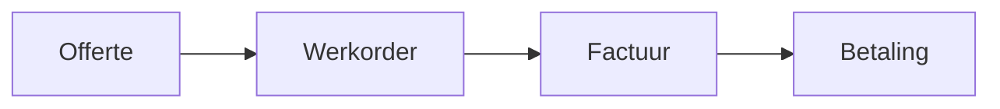

# Documentation Style Guide 📝

**Voor:** Alle contributors (developers, AI agents, technical writers)
**Doel:** Consistente, professionele en onderhoudbare documentatie
**Versie:** 1.0.0
**Laatst bijgewerkt:** Januari 2025

---

## 🎯 Waarom Deze Guide?

Consistente documentatie zorgt voor:
- ✅ Snellere onboarding van nieuwe developers
- ✅ Minder cognitieve belasting voor lezers
- ✅ Betere zoekbaarheid (SEO & Ctrl+F)
- ✅ Professionele uitstraling
- ✅ Gemakkelijker onderhoud

**VERPLICHTE READING**: Deze guide is verplicht voor alle documentatie wijzigingen.

---

## 🌍 Taal & Tone

### Taalgebruik

#### ✅ Nederlands voor UI & Gebruikersdocumentatie
```markdown
## Werkorder Aanmaken

1. Klik op **"Nieuwe Werkorder"**
2. Vul de **Klantnaam** in
3. Selecteer de **Status**
4. Klik op **"Opslaan"**

**Tip:** Je kunt een werkorder dupliceren met de **"Dupliceren"** knop.
```

#### ✅ Engels voor Technische/Code Documentatie
```markdown
## WorkOrder Component

### Props
- `workOrder: WorkOrder` - The work order object
- `onUpdate: (id: string) => void` - Update callback
- `isAdmin: boolean` - Admin permission flag

### Example Usage
```typescript
<WorkOrderCard
  workOrder={workOrder}
  onUpdate={handleUpdate}
  isAdmin={user.role === 'admin'}
/>
```
```

#### ❌ NIET Mengen
```markdown
<!-- ❌ FOUT -->
## Werkorder Component

### Props
- workOrder: WorkOrder object
- onUpdate callback functie
```

### Tone Guidelines

#### Voor Gebruikersdocumentatie
- **Vriendelijk & Toegankelijk**: "Je kunt gemakkelijk een offerte aanmaken..."
- **Directe aanspraak**: Gebruik "je/jij" (informeel) voor gebruikers
- **Actieve stem**: "Klik op de knop" (niet: "De knop wordt geklikt")
- **Positief**: "Zo werkt het" (niet: "Zo voorkom je fouten")

#### Voor Technische Documentatie
- **Professioneel & Precies**: "The component accepts three props..."
- **Imperatieven**: "Use TypeScript interfaces" (niet: "You should use...")
- **Objectief**: Geen emotionele taal
- **Concise**: Kort en bondig

---

## 🎨 Emoji Conventies

### Vaste Emoji Toewijzingen

**BELANGRIJK**: Gebruik altijd dezelfde emoji voor hetzelfde concept.

#### Sectie Headers
```markdown
## 🎯 Doel                    # Goals, objectives
## 📋 Overzicht               # Overview, summary
## 🚀 Quick Start             # Getting started, onboarding
## ⚙️ Installatie             # Installation, setup
## 🏗️ Architectuur            # Architecture, structure
## 📚 Modules                 # Modules, features
## 🔒 Beveiliging             # Security, permissions
## 🐛 Troubleshooting         # Bugs, issues
## 📖 Voorbeeld               # Examples, demos
## 💡 Tips & Tricks           # Pro tips, best practices
## ⚠️ Waarschuwingen          # Warnings, critical notes
## ❓ FAQ                     # Frequently asked questions
## 📞 Support                 # Help, contact
```

#### Inline Status Indicators
```markdown
✅ Correct                    # Approved, good example
❌ Fout                       # Wrong, bad example
⚠️ Let op                     # Warning, caution
🔄 In ontwikkeling            # Work in progress
📝 TODO                       # To do, pending
🎯 Aanbeveling                # Recommendation
⚡ Performance tip            # Speed, optimization
🔐 Security tip               # Safety, protection
```

#### Module Icons (Consistent met Sidebar)
```markdown
📊 Dashboard
📦 Voorraadbeheer (Inventory)
🔧 Werkorders (Work Orders)
💰 Boekhouding (Accounting)
👥 CRM
👨‍💼 HRM
🛒 POS
📅 Planning
📈 Reports
🛍️ Webshop
⚙️ Admin Settings
🔔 Notificaties
```

#### User Roles
```markdown
👤 User (Medewerker)
👨‍💼 Admin (Manager)
🤖 AI Agent
```

### ❌ Emoji Pitfalls - VERMIJD

```markdown
<!-- ❌ FOUT: Inconsistent gebruik -->
## 🎯 Doel
## 🎪 Doel van dit document  # Verkeerde emoji

<!-- ❌ FOUT: Overmatig gebruik -->
Welkom! 🎉 Dit document 📄 legt uit 📖 hoe je 🧑‍💻 de module 🧩 gebruikt! 🚀

<!-- ✅ CORRECT: Matig gebruik -->
Welkom! Dit document legt uit hoe je de module gebruikt. 🚀
```

**Regel**: Max 1 emoji per heading, max 3 emoji's per paragraaf.

---

## 📐 Markdown Formatting

### Headings Hierarchy

```markdown
# H1 - Document Titel (1x per document)
## H2 - Hoofdsecties
### H3 - Subsecties
#### H4 - Details (vermijd dieper dan H4)
```

**Regels**:
- ✅ **Altijd spatie** na `#`: `## Titel` (niet `##Titel`)
- ✅ **Geen lege H1**: Elke H1 moet content hebben
- ✅ **Logische volgorde**: H1 → H2 → H3 (niet: H1 → H3)
- ❌ **Geen skip levels**: Nooit van H2 naar H4 springen

### Code Blocks

#### Met Syntax Highlighting
```markdown
```typescript
interface WorkOrder {
  id: string;
  title: string;
  status: WorkOrderStatus;
}
```
```

**Ondersteunde talen**:
- `typescript` / `ts` - TypeScript code
- `javascript` / `js` - JavaScript code
- `tsx` - React components
- `json` - JSON data
- `bash` / `shell` - Terminal commands
- `css` - Stylesheets
- `markdown` / `md` - Markdown examples

#### Terminal Commands
```markdown
```bash
# Install dependencies
npm install

# Run development server
npm run dev

# Build for production
npm run build
```
```

**Regels**:
- ✅ **Altijd comments** voor complexe commands
- ✅ **Output tonen** indien relevant
- ❌ **Geen sudo** in voorbeelden (tenzij vereist)

#### DO/DON'T Examples
```markdown
```typescript
// ✅ CORRECT
const workOrder: WorkOrder = { ... };
setWorkOrders([...workOrders, newWorkOrder]);

// ❌ FOUT
const workOrder: any = { ... };  // Nooit 'any' gebruiken
workOrders.push(newWorkOrder);   // Direct mutation
```
```

### Lists

#### Ordered Lists (Numbered)
```markdown
1. Eerste stap - gebruik voor sequenties
2. Tweede stap - volgorde is belangrijk
3. Derde stap - genummerd
```

#### Unordered Lists (Bulleted)
```markdown
- Voorraadbeheer - gebruik voor groepen
- Werkorders - volgorde niet belangrijk
- Boekhouding - lijstitems
```

#### Nested Lists
```markdown
1. **Hoofdstap**
   - Substap A
   - Substap B
     - Detail 1
     - Detail 2
2. **Volgende hoofdstap**
```

**Regels**:
- ✅ **2 spaties** voor nested items (niet tabs)
- ✅ **Bold** voor belangrijke list items
- ✅ **Max 3 niveaus** diep (leesbaarheid)

### Links

#### Internal Links (Binnen Docs)
```markdown
<!-- ✅ CORRECT: Relatieve paden -->
Zie [Technical Stack](./02-architecture/technical-stack.md) voor details.
Lees meer in [CONVENTIONS.md](../CONVENTIONS.md).

<!-- ❌ FOUT: Absolute paden -->
Zie [Technical Stack](/home/user/docs/02-architecture/technical-stack.md).
```

#### External Links
```markdown
<!-- ✅ CORRECT: Volledige URL -->
Bekijk de [React 19 docs](https://react.dev/blog/2024/12/05/react-19).

<!-- Voor veelvoorkomende externe links: gebruik footnotes -->
Volgens de OWASP Top 10[^1] is broken access control het #1 risico.

[^1]: [OWASP Top 10 2021](https://owasp.org/Top10/)
```

#### Anchor Links (Binnen Document)
```markdown
## 📚 Inhoudsopgave
- [Installatie](#installatie)
- [Configuratie](#configuratie)
- [Troubleshooting](#troubleshooting)

## ⚙️ Installatie
Content here...
```

**Regels**:
- ✅ **Lowercase** voor anchors: `#installatie` (niet `#Installatie`)
- ✅ **Streepjes** voor spaties: `#quick-start` (niet `#quick_start`)
- ✅ **Verwijder emoji's** uit anchors: `#installatie` (niet `#⚙️-installatie`)

### Tables

```markdown
| Kolom 1 | Kolom 2 | Kolom 3 |
|---------|---------|---------|
| Data A  | Data B  | Data C  |
| Data D  | Data E  | Data F  |
```

**Alignment Options**:
```markdown
| Links | Midden | Rechts |
|:------|:------:|-------:|
| L1    |  M1    |     R1 |
```

**Regels**:
- ✅ **Header row verplicht**
- ✅ **Pipe alignment** voor leesbaarheid
- ✅ **Max 5 kolommen** (anders: gebruik lijsten)
- ✅ **Bold headers** indien nodig: `| **Naam** | **Type** |`

### Blockquotes

```markdown
> **Note:** Dit is een belangrijke opmerking.

> ⚠️ **Warning:** Dit kan leiden tot dataverlies!

> 💡 **Tip:** Gebruik Ctrl+F voor snel zoeken.
```

**Types**:
- **Note** (informatie): Neutral information
- **Warning** (waarschuwing): Potential issues
- **Tip** (advies): Helpful suggestions
- **Danger** (gevaar): Critical warnings

### Horizontal Rules

```markdown
---
```

**Gebruik**:
- ✅ Scheiden van hoofdsecties
- ✅ Voor/na belangrijke overgangen
- ❌ Niet overmatig (max 5 per document)

---

## 📸 Visual Content

### Screenshots

#### Placeholder Formaat
```markdown

*Screenshot: Dashboard hoofdscherm met recente werkorders*

<!-- Als screenshot nog niet bestaat: -->
🖼️ **[SCREENSHOT PLACEHOLDER: Dashboard Overview]**
**Toon:** Hoofdscherm met werkorder lijst, filters, en "Nieuwe Werkorder" knop
**Vereist:** Resolutie 1920x1080, Chrome browser, demo data geladen
```

#### Naming Conventions
```bash
# Format: [module]-[view]-[detail].png
dashboard-overview.png
inventory-sku-modal.png
workorders-kanban-board.png
accounting-quote-form.png
crm-customer-detail.png
```

**Regels**:
- ✅ **Lowercase met streepjes**
- ✅ **Descriptive names**
- ✅ **PNG format** (voor UI screenshots)
- ✅ **Max 2MB** file size (comprimeer indien nodig)

### Diagrams

#### Mermaid Diagrams (Preferred)
```markdown

```

#### Placeholder voor Complexe Diagrams
```markdown
📊 **[DIAGRAM PLACEHOLDER: Authentication Flow]**
**Type:** Sequence diagram
**Toon:** Login → JWT Token → API Request → Response
**Tool:** Mermaid of draw.io
**File:** docs/diagrams/auth-flow.mermaid
```

**Diagram Types**:
- `flowchart` / `graph` - Process flows
- `sequenceDiagram` - Interactions over time
- `classDiagram` - Object structure
- `erDiagram` - Database relations

---

## 🗂️ File & Folder Structure

### Naming Conventions

#### Markdown Files
```bash
# Format: kebab-case.md
quick-start.md              # ✅ CORRECT
technical-stack.md          # ✅ CORRECT
security-owasp-mapping.md   # ✅ CORRECT

QuickStart.md               # ❌ FOUT (PascalCase)
technical_stack.md          # ❌ FOUT (snake_case)
```

#### Folder Names
```bash
docs/
├── 01-getting-started/     # ✅ Numbered voor volgorde
├── 02-architecture/
├── 03-modules/
├── 04-features/
├── 05-api/
└── 06-changelog/
```

**Regels**:
- ✅ **Numbered prefixes** voor sequentiële docs
- ✅ **Descriptive names** (niet: `docs/misc/`)
- ✅ **Max 3 niveaus** diep (anders: herstructureren)

### File Headers (Front Matter)

#### Standard Header Format
```markdown
# Document Titel 🎯

**Voor:** Target audience (bijv. "Developers", "End Users", "Admins")
**Versie:** Semantic version (bijv. "1.2.0")
**Laatst bijgewerkt:** Maand Jaar (bijv. "Januari 2025")
**Status:** Draft | Review | Production

---

[Document content starts here]
```

**Verplichte velden**:
- ✅ **Voor**: Wie is de doelgroep?
- ✅ **Versie**: Volg [Semantic Versioning](https://semver.org/)
- ✅ **Laatst bijgewerkt**: Maand + Jaar
- ✅ **Status** (optioneel): Lifecycle indicator

---

## 💻 Code Documentation

### Inline Code

```markdown
Gebruik de `WorkOrder` interface voor werkorder objecten.
De functie `calculateTotal()` berekent het totaal.
Installeer met `npm install vite`.
```

**Gebruik inline code voor**:
- Variable/function namen
- File paths
- Terminal commands (kort)
- Type names

### Code Examples

#### Full Component Example
```markdown
### WorkOrderCard Component

**Purpose:** Displays a single work order in card format

**Props:**
- `workOrder: WorkOrder` - The work order data
- `onUpdate: (id: string) => void` - Update handler
- `isAdmin: boolean` - Permission flag

**Example Usage:**
```tsx
import { WorkOrderCard } from '@/components/workorders';

function WorkOrderList() {
  const workOrders = useWorkOrders();
  const user = useUser();

  return (
    <div className="grid grid-cols-1 md:grid-cols-3 gap-4">
      {workOrders.map(wo => (
        <WorkOrderCard
          key={wo.id}
          workOrder={wo}
          onUpdate={handleUpdate}
          isAdmin={user.role === 'admin'}
        />
      ))}
    </div>
  );
}
```

**Key Features:**
- Responsive grid layout (1 col mobile, 3 cols desktop)
- Admin-only actions (edit, delete)
- Real-time status updates
```
```

**Regels**:
- ✅ **Altijd working examples** (test de code!)
- ✅ **Include imports**
- ✅ **Show realistic data**
- ✅ **Comment complex parts**

### API Documentation

```markdown
## createWorkOrder()

**Signature:**
```typescript
function createWorkOrder(
  data: CreateWorkOrderInput
): Promise<WorkOrder>
```

**Parameters:**
| Name | Type | Required | Description |
|------|------|----------|-------------|
| `data` | `CreateWorkOrderInput` | Yes | Work order creation data |
| `data.title` | `string` | Yes | Work order title (min 3 chars) |
| `data.customerId` | `string` | Yes | Customer UUID |
| `data.description` | `string` | No | Detailed description |

**Returns:**
- `Promise<WorkOrder>` - The created work order with generated ID

**Throws:**
- `ValidationError` - Invalid input data
- `PermissionError` - User lacks create permission

**Example:**
```typescript
try {
  const workOrder = await createWorkOrder({
    title: 'Reparatie Machine A',
    customerId: 'cust-123',
    description: 'Motor maakt vreemd geluid'
  });
  console.log('Created:', workOrder.id);
} catch (error) {
  if (error instanceof ValidationError) {
    console.error('Invalid data:', error.message);
  }
}
```
```

---

## 📊 Documentation Templates

### Module Documentation Template

```markdown
# [Module Naam] Module 🎯

**Voor:** End Users & Developers
**Versie:** X.Y.Z
**Laatst bijgewerkt:** Maand Jaar
**Status:** Production

---

## 🎯 Doel

[1-2 zinnen: Wat doet deze module?]

---

## 📋 Overzicht

### Belangrijkste Functies
- ✅ Functie 1 - Korte beschrijving
- ✅ Functie 2 - Korte beschrijving
- ✅ Functie 3 - Korte beschrijving

### Rechten
- **Admin**: Volledige toegang (create, read, update, delete)
- **User**: Beperkte toegang (read, update eigen data)

---

## 🚀 Quick Start

### Voor Gebruikers
1. Navigeer naar **[Module Naam]** in sidebar
2. Klik op **"Nieuwe [Item]"**
3. Vul vereiste velden in
4. Klik op **"Opslaan"**

### Voor Developers
```bash
# Install dependencies
npm install

# Import module
import { [ModuleName] } from '@/features/[module-name]';
```

---

## 📚 Features

### Feature 1: [Naam]

**Beschrijving:** [Wat doet deze feature?]

**Gebruik:**
1. Stap 1
2. Stap 2
3. Stap 3

**Screenshot:**


---

## 🏗️ Technische Details

### File Structure
```
src/
├── features/[module-name]/
│   ├── hooks/
│   ├── services/
│   ├── utils/
│   └── types/
└── components/[module-name]/
    ├── [Component].tsx
    └── index.ts
```

### Key Components
- **[ComponentName]**: [Beschrijving]
- **[ComponentName2]**: [Beschrijving]

### State Management
[Hoe wordt state beheerd in deze module?]

---

## 🐛 Troubleshooting

### Probleem: [Veelvoorkomend probleem]

**Symptomen:**
- Symptoom 1
- Symptoom 2

**Oplossing:**
1. Stap 1
2. Stap 2

---

## ❓ FAQ

**Q: [Vraag]**
A: [Antwoord]

---

## 📖 Zie Ook

- [Gerelateerd Document 1](./link.md)
- [Gerelateerd Document 2](./link.md)

---

**Laatste update:** Maand Jaar
**Versie:** X.Y.Z
```

### Feature Documentation Template

```markdown
# [Feature Naam] 🚀

**Voor:** [Audience]
**Module:** [Parent Module]
**Versie:** X.Y.Z
**Status:** Production

---

## 🎯 Wat is dit?

[1-2 zinnen: Wat doet deze feature en waarom is het belangrijk?]

---

## 📋 Requirements

### Functionele Requirements
- ✅ Requirement 1
- ✅ Requirement 2

### Technische Requirements
- ✅ React 19+
- ✅ TypeScript 5.3+
- ✅ [Andere dependencies]

---

## 🚀 Gebruik

### Voor End Users

**Stap 1: [Titel]**
[Beschrijving + screenshot]

**Stap 2: [Titel]**
[Beschrijving + screenshot]

### Voor Developers

**Installation:**
```bash
npm install [package]
```

**Basic Usage:**
```tsx
[Code example]
```

---

## 🏗️ Implementation

### Architecture
[Diagram of beschrijving]

### Code Example
```typescript
[Detailed code example]
```

---

## 🐛 Troubleshooting

[Common issues and solutions]

---

**Laatste update:** Maand Jaar
```

---

## ✅ Documentation Checklist

### Voor Elke Document Update

- [ ] **Language Check**
  - [ ] Nederlands voor UI/gebruikers docs
  - [ ] Engels voor technische/code docs
  - [ ] Geen menging van talen

- [ ] **Formatting Check**
  - [ ] Correcte heading hierarchy (H1 → H2 → H3)
  - [ ] Code blocks hebben syntax highlighting
  - [ ] Links werken (test alle links!)
  - [ ] Tables zijn correct geformatteerd

- [ ] **Content Check**
  - [ ] Front matter compleet (Voor, Versie, Laatst bijgewerkt)
  - [ ] Doel/overzicht in eerste sectie
  - [ ] Code examples zijn getest
  - [ ] Screenshots zijn actueel

- [ ] **Style Check**
  - [ ] Emoji's consistent gebruikt (zie emoji table)
  - [ ] Tone consistent (vriendelijk voor users, professioneel voor devs)
  - [ ] Max 1 emoji per heading
  - [ ] Geen typo's (run spell check!)

- [ ] **Cross-Reference Check**
  - [ ] Gerelateerde docs gelinkt
  - [ ] INDEX.md bijgewerkt (indien nieuwe doc)
  - [ ] Changelog bijgewerkt (indien wijziging)

---

## 🔍 Review Process

### Self-Review
1. **Lees document hardop** - Vindt awkward formuleringen
2. **Test alle code examples** - Moet werken zonder errors
3. **Klik alle links** - Geen broken links
4. **Check mobile view** - Lange tables/code blocks

### Peer Review
1. **Submit PR** met duidelijke beschrijving
2. **Tag reviewers** (@docs-team of @senior-dev)
3. **Address feedback** binnen 24 uur
4. **Merge** na approval

---

## 📚 Gerelateerde Documentatie

- [CONVENTIONS.md](../CONVENTIONS.md) - Code style guide
- [AI_GUIDE.md](./AI_GUIDE.md) - Voor AI agents
- [GLOSSARY.md](./GLOSSARY.md) - Terminologie
- [MULTI_AGENT_WORKFLOW.md](./MULTI_AGENT_WORKFLOW.md) - Multi-agent docs

---

## 🆘 Help & Vragen

**Twijfel over stijl?**
- Check voorbeelden in bestaande docs
- Vraag in #docs channel
- Tag @docs-lead voor advies

**Nieuwe sectie nodig?**
- Submit issue met voorstel
- Include use case
- Suggest template

---

## 📊 Metrics & Quality

### Documentation Quality Targets

| Metric | Target | Huidige Status |
|--------|--------|----------------|
| Link validity | 100% | 🔄 Checking |
| Code example accuracy | 100% | 🔄 Testing |
| Screenshot freshness | < 6 months | 🔄 Updating |
| Spelling errors | 0 | ✅ Clean |
| Broken references | 0 | ✅ Clean |

### Monthly Review

- 🔍 **First Monday**: Link check (alle docs)
- 📸 **Second Monday**: Screenshot review
- 📝 **Third Monday**: Content accuracy review
- 🧹 **Fourth Monday**: Deprecation cleanup

---

## 🚀 Continuous Improvement

### Feedback Welkom!

Deze style guide is een **living document**. Verbeteringen zijn welkom!

**Hoe bijdragen:**
1. Open issue met suggestie
2. Tag met `documentation` label
3. Submit PR met wijziging
4. Update version number

---

**Laatste update:** Januari 2025
**Versie:** 1.0.0
**Status:** Production

**Happy documenting! 📝✨**
