# Visual Content Guide 📸

**Voor:** Documentation Team, UI/UX Designers, Developers
**Doel:** Overzicht van benodigde screenshots en diagrammen voor complete documentatie
**Versie:** 1.0.0
**Laatst bijgewerkt:** Januari 2025

---

## 🎯 Doel

Deze guide documenteert:
1. **Welke screenshots** ontbreken in de documentatie
2. **Welke diagrammen** moeten worden aangemaakt
3. **Placeholder formats** voor missing visuals
4. **Screenshot specificaties** (resolutie, format, styling)
5. **Diagram templates** (Mermaid voorbeelden)

---

## 📊 Status Overview

### Current Visual Content Status

| Category | Totaal Benodigd | Aanwezig | Ontbreekt | % Complete |
|----------|----------------|----------|-----------|------------|
| **Screenshots** | 87 | 0 | 87 | 0% |
| **Diagrams** | 23 | 0 | 23 | 0% |
| **Icons** | 12 | 12 | 0 | 100% (emoji) |
| **UI Examples** | 45 | 0 (code only) | 45 | 0% |

**Total Visual Assets Needed:** 155

---

## 📸 Screenshots Needed

### Module Screenshots (87 total)

#### 1. Dashboard Module (8 screenshots)

```markdown
🖼️ **[SCREENSHOT: dashboard-overview.png]**
**Locatie:** docs/03-modules/dashboard.md (sectie: Overzicht)
**Toon:** Dashboard hoofdscherm met KPI cards, werkorder overzicht, voorraad alerts
**Vereisten:**
- Resolutie: 1920x1080 (desktop view)
- Browser: Chrome (laatste versie)
- Data: Demo data geladen (10+ werkorders, 5+ klanten)
- Ingelogd als: Admin (voor volledige weergave)
- Highlight: Email drop zone zichtbaar
**Filename:** dashboard-overview.png
**Alt text:** Dashboard overzicht met KPI cards en email drop zone
```

```markdown
🖼️ **[SCREENSHOT: dashboard-email-dropzone.png]**
**Locatie:** docs/03-modules/dashboard.md (sectie: Email Drop Zone)
**Toon:** Email drop zone actief tijdens drag-and-drop
**Vereisten:**
- Show: Gebruiker sleept .eml bestand over dashboard
- Highlight: Drop zone border actief (glow effect)
- Data: Email preview zichtbaar
**Filename:** dashboard-email-dropzone.png
**Alt text:** Email drag-and-drop zone actief tijdens email upload
```

```markdown
🖼️ **[SCREENSHOT: dashboard-kpi-cards.png]**
**Locatie:** docs/03-modules/dashboard.md (sectie: KPI Cards)
**Toon:** Close-up van 4 KPI cards (Omzet, Werkorders, Klanten, Voorraad)
**Vereisten:**
- Crop: Alleen KPI cards sectie
- Data: Realistische cijfers (€15.2K omzet, 12 actieve WO, etc.)
**Filename:** dashboard-kpi-cards.png
```

```markdown
🖼️ **[SCREENSHOT: dashboard-workorder-list.png]**
**Locatie:** docs/03-modules/dashboard.md
**Toon:** Recente werkorders lijst met status badges
**Filename:** dashboard-workorder-list.png
```

```markdown
🖼️ **[SCREENSHOT: dashboard-notifications-panel.png]**
**Locatie:** docs/03-modules/dashboard.md
**Toon:** Notificaties paneel met ongelezen meldingen
**Filename:** dashboard-notifications-panel.png
```

```markdown
🖼️ **[SCREENSHOT: dashboard-low-stock-alerts.png]**
**Locatie:** docs/03-modules/dashboard.md
**Toon:** Lage voorraad alerts sectie
**Filename:** dashboard-low-stock-alerts.png
```

```markdown
🖼️ **[SCREENSHOT: dashboard-mobile.png]**
**Locatie:** docs/04-features/mobile-optimization.md
**Toon:** Dashboard op mobiel (iPhone 13 Pro viewport: 390x844)
**Vereisten:**
- Responsive layout: 1 kolom
- Touch-friendly buttons
**Filename:** dashboard-mobile.png
```

```markdown
🖼️ **[SCREENSHOT: dashboard-email-preview-modal.png]**
**Locatie:** docs/03-modules/dashboard.md (sectie: Email Integration)
**Toon:** Email preview modal na drop
**Vereisten:**
- Modal open met email content
- Action buttons zichtbaar (Create Order, Create Task, etc.)
**Filename:** dashboard-email-preview-modal.png
```

#### 2. Werkorders Module (12 screenshots)

```markdown
🖼️ **[SCREENSHOT: workorders-kanban-board.png]**
**Locatie:** docs/03-modules/workorders.md (sectie: Kanban Workboard)
**Toon:** Kanban board met 3 kolommen (Pending, Active, Completed)
**Vereisten:**
- Resolutie: 1920x1080
- Data: 15+ werkorders verdeeld over kolommen
- Drag indicator zichtbaar (optioneel: tijdens drag)
**Filename:** workorders-kanban-board.png
```

```markdown
🖼️ **[SCREENSHOT: workorders-create-modal.png]**
**Locatie:** docs/03-modules/workorders.md
**Toon:** "Nieuwe Werkorder" modal met form fields
**Vereisten:**
- Form fields: Titel, Klant, Beschrijving, Status
- Validation states zichtbaar
**Filename:** workorders-create-modal.png
```

```markdown
🖼️ **[SCREENSHOT: workorders-detail-view.png]**
**Locatie:** docs/03-modules/workorders.md
**Toon:** Werkorder detail view (full page)
**Filename:** workorders-detail-view.png
```

```markdown
🖼️ **[SCREENSHOT: workorders-filters.png]**
**Locatie:** docs/03-modules/workorders.md
**Toon:** Filter controls (status, klant, datum range)
**Filename:** workorders-filters.png
```

```markdown
🖼️ **[SCREENSHOT: workorders-search.png]**
**Locatie:** docs/03-modules/workorders.md
**Toon:** Search bar met autocomplete results
**Filename:** workorders-search.png
```

```markdown
🖼️ **[SCREENSHOT: workorders-status-update.png]**
**Locatie:** docs/03-modules/workorders.md
**Toon:** Status dropdown menu tijdens update
**Filename:** workorders-status-update.png
```

```markdown
🖼️ **[SCREENSHOT: workorders-drag-drop.png]**
**Locatie:** docs/03-modules/workorders.md (sectie: Kanban)
**Toon:** Card mid-drag tussen kolommen
**Filename:** workorders-drag-drop.png
```

```markdown
🖼️ **[SCREENSHOT: workorders-mobile-list.png]**
**Locatie:** docs/04-features/mobile-optimization.md
**Toon:** Werkorders lijst op mobiel (stacked cards)
**Filename:** workorders-mobile-list.png
```

```markdown
🖼️ **[SCREENSHOT: workorders-empty-state.png]**
**Locatie:** docs/03-modules/workorders.md
**Toon:** Empty state when no workorders exist
**Filename:** workorders-empty-state.png
```

```markdown
🖼️ **[SCREENSHOT: workorders-edit-modal.png]**
**Locatie:** docs/03-modules/workorders.md
**Toon:** Edit werkorder modal (pre-filled)
**Filename:** workorders-edit-modal.png
```

```markdown
🖼️ **[SCREENSHOT: workorders-delete-confirm.png]**
**Locatie:** docs/03-modules/workorders.md (Admin only)
**Toon:** Delete confirmation dialog
**Filename:** workorders-delete-confirm.png
```

```markdown
🖼️ **[SCREENSHOT: workorders-permissions-error.png]**
**Locatie:** docs/04-features/user-roles.md
**Toon:** User attempting admin action (delete) - error message
**Filename:** workorders-permissions-error.png
```

#### 3. Voorraadbeheer Module (10 screenshots)

```markdown
🖼️ **[SCREENSHOT: inventory-overview.png]**
**Locatie:** docs/03-modules/inventory.md
**Toon:** Voorraad overzicht met 3 tabs (SKU Types)
**Vereisten:**
- Tabs: Products, Materials, Services
- Table with inventory items
- Low stock warnings visible
**Filename:** inventory-overview.png
```

```markdown
🖼️ **[SCREENSHOT: inventory-sku-modal.png]**
**Locatie:** docs/03-modules/inventory.md
**Toon:** Create SKU modal (Product type)
**Filename:** inventory-sku-modal.png
```

```markdown
🖼️ **[SCREENSHOT: inventory-categories.png]**
**Locatie:** docs/03-modules/inventory.md
**Toon:** Category management interface
**Filename:** inventory-categories.png
```

```markdown
🖼️ **[SCREENSHOT: inventory-low-stock-filter.png]**
**Locatie:** docs/03-modules/inventory.md
**Toon:** Low stock filter active (red badges)
**Filename:** inventory-low-stock-filter.png
```

```markdown
🖼️ **[SCREENSHOT: inventory-search-filter.png]**
**Locatie:** docs/03-modules/inventory.md
**Toon:** Search + filter controls
**Filename:** inventory-search-filter.png
```

```markdown
🖼️ **[SCREENSHOT: inventory-stock-adjustment.png]**
**Locatie:** docs/03-modules/inventory.md
**Toon:** Stock count adjustment modal
**Filename:** inventory-stock-adjustment.png
```

```markdown
🖼️ **[SCREENSHOT: inventory-product-details.png]**
**Locatie:** docs/03-modules/inventory.md
**Toon:** Product detail view (full info)
**Filename:** inventory-product-details.png
```

```markdown
🖼️ **[SCREENSHOT: inventory-material-tab.png]**
**Locatie:** docs/03-modules/inventory.md
**Toon:** Materials tab active (different from Products)
**Filename:** inventory-material-tab.png
```

```markdown
🖼️ **[SCREENSHOT: inventory-services-tab.png]**
**Locatie:** docs/03-modules/inventory.md
**Toon:** Services tab (no stock counts)
**Filename:** inventory-services-tab.png
```

```markdown
🖼️ **[SCREENSHOT: inventory-mobile.png]**
**Locatie:** docs/04-features/mobile-optimization.md
**Toon:** Inventory on mobile (compact cards)
**Filename:** inventory-mobile.png
```

#### 4. Boekhouding Module (15 screenshots)

```markdown
🖼️ **[SCREENSHOT: accounting-overview.png]**
**Locatie:** docs/03-modules/accounting.md
**Toon:** Accounting overzicht met tabs (Offertes, Facturen)
**Filename:** accounting-overview.png
```

```markdown
🖼️ **[SCREENSHOT: accounting-quote-form.png]**
**Locatie:** docs/03-modules/accounting.md (sectie: Offertes)
**Toon:** Create offerte form
**Vereisten:**
- Fields: Klant, Items, Bedragen, BTW
- Line items table
**Filename:** accounting-quote-form.png
```

```markdown
🖼️ **[SCREENSHOT: accounting-quote-list.png]**
**Locatie:** docs/03-modules/accounting.md
**Toon:** Offertes lijst met status (Pending, Accepted, Rejected)
**Filename:** accounting-quote-list.png
```

```markdown
🖼️ **[SCREENSHOT: accounting-invoice-form.png]**
**Locatie:** docs/03-modules/accounting.md (sectie: Facturen)
**Toon:** Create factuur form
**Filename:** accounting-invoice-form.png
```

```markdown
🖼️ **[SCREENSHOT: accounting-invoice-list.png]**
**Locatie:** docs/03-modules/accounting.md
**Toon:** Facturen lijst met payment status
**Filename:** accounting-invoice-list.png
```

```markdown
🖼️ **[SCREENSHOT: accounting-quote-to-invoice.png]**
**Locatie:** docs/04-features/workorder-workflow.md
**Toon:** Convert quote to invoice button/modal
**Filename:** accounting-quote-to-invoice.png
```

```markdown
🖼️ **[SCREENSHOT: accounting-pdf-preview.png]**
**Locatie:** docs/03-modules/accounting.md
**Toon:** PDF preview van factuur
**Filename:** accounting-pdf-preview.png
```

```markdown
🖼️ **[SCREENSHOT: accounting-payment-modal.png]**
**Locatie:** docs/03-modules/accounting.md
**Toon:** Mark as paid modal
**Filename:** accounting-payment-modal.png
```

```markdown
🖼️ **[SCREENSHOT: accounting-calculations.png]**
**Locatie:** docs/03-modules/accounting.md
**Toon:** Automatic calculations (subtotal, BTW, totaal)
**Filename:** accounting-calculations.png
```

```markdown
🖼️ **[SCREENSHOT: accounting-line-items.png]**
**Locatie:** docs/03-modules/accounting.md
**Toon:** Line items table in quote/invoice form
**Filename:** accounting-line-items.png
```

```markdown
🖼️ **[SCREENSHOT: accounting-email-invoice.png]**
**Locatie:** docs/03-modules/accounting.md
**Toon:** Email invoice modal
**Filename:** accounting-email-invoice.png
```

```markdown
🖼️ **[SCREENSHOT: accounting-quote-accepted.png]**
**Locatie:** docs/03-modules/accounting.md
**Toon:** Quote with "Accepted" status badge
**Filename:** accounting-quote-accepted.png
```

```markdown
🖼️ **[SCREENSHOT: accounting-invoice-paid.png]**
**Locatie:** docs/03-modules/accounting.md
**Toon:** Invoice with "Paid" status badge
**Filename:** accounting-invoice-paid.png
```

```markdown
🖼️ **[SCREENSHOT: accounting-filters.png]**
**Locatie:** docs/03-modules/accounting.md
**Toon:** Filter controls (status, date range, klant)
**Filename:** accounting-filters.png
```

```markdown
🖼️ **[SCREENSHOT: accounting-mobile-quote.png]**
**Locatie:** docs/04-features/mobile-optimization.md
**Toon:** Quote form on mobile (scrollable)
**Filename:** accounting-mobile-quote.png
```

#### 5-12. Other Modules (42 screenshots)

**CRM:** 6 screenshots (customer list, detail, edit, filters, merge duplicates, email)
**HRM:** 5 screenshots (employee list, add, permissions, login credentials, role badge)
**POS:** 8 screenshots (cashier interface, payment modal, receipt, cash drawer, refund)
**Planning:** 5 screenshots (calendar view, create event, reminders, export)
**Reports:** 10 screenshots (dashboard, filters, export options, charts x3, tables x2)
**Webshop:** 9 screenshots (product grid, cart, checkout, payment, order confirm)
**Admin Settings:** 5 screenshots (settings tabs, import/export, demo reset, user management)
**Notifications:** 5 screenshots (notification center, unread badge, mark as read, push settings)

---

## 📊 Diagrams Needed

### Architecture Diagrams (8 diagrams)

#### 1. System Architecture Overview

```markdown
📊 **[DIAGRAM: system-architecture-overview.mermaid]**
**Locatie:** docs/02-architecture/technical-stack.md
**Type:** Component diagram
**Toon:** React 19 → State (App.tsx) → Components → UI
**Tool:** Mermaid
**Bestand:** docs/diagrams/system-architecture.mermaid
```

**Template:**
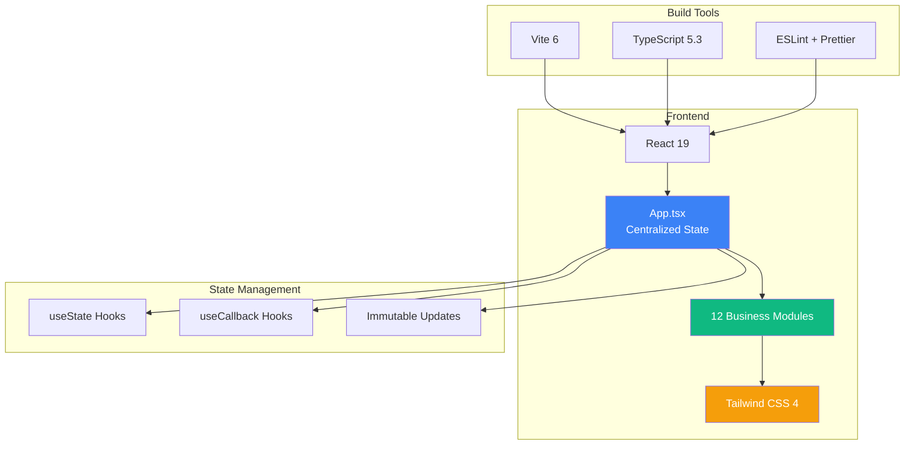

#### 2. State Flow Diagram

```markdown
📊 **[DIAGRAM: state-flow.mermaid]**
**Locatie:** docs/02-architecture/state-management.md
**Type:** Sequence diagram
**Toon:** User Action → Component → App.tsx → State Update → Re-render
```

**Template:**
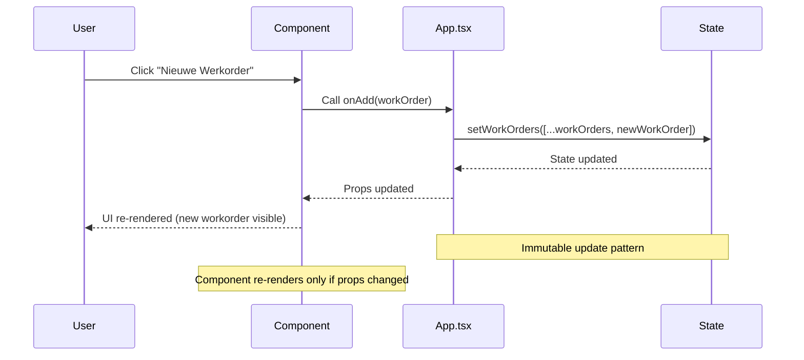

#### 3. Workorder Workflow

```markdown
📊 **[DIAGRAM: workorder-workflow.mermaid]**
**Locatie:** docs/04-features/workorder-workflow.md
**Type:** Flowchart
**Toon:** Offerte → Werkorder → Factuur → Betaling
```

**Template:**
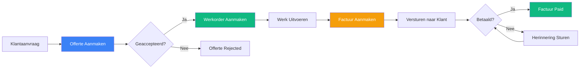

#### 4. User Authentication Flow

```markdown
📊 **[DIAGRAM: auth-flow.mermaid]**
**Locatie:** docs/02-architecture/security.md
**Type:** Sequence diagram
**Toon:** Login → Credentials Check → JWT (future) → Access Grant
```

**Template:**
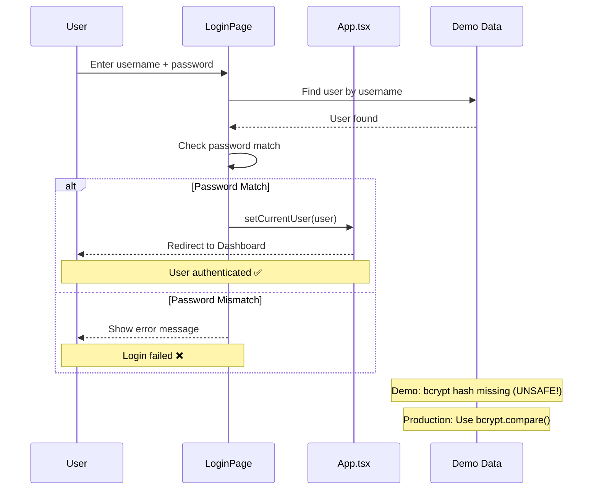

#### 5. Multi-Agent Workflow

```markdown
📊 **[DIAGRAM: multi-agent-workflow.mermaid]**
**Locatie:** docs/MULTI_AGENT_WORKFLOW.md
**Type:** Flowchart
**Toon:** Architecture Agent → Feature Agents → Integration Agent → Testing Agent
```

**Template:**
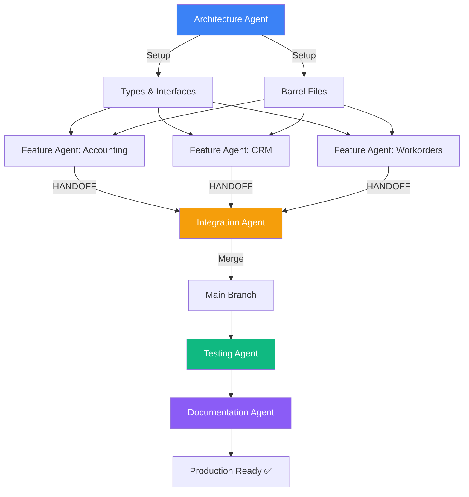

#### 6. Module Dependency Graph

```markdown
📊 **[DIAGRAM: module-dependencies.mermaid]**
**Locatie:** docs/02-architecture/file-structure.md
**Type:** Graph
**Toon:** Which modules depend on which (e.g., Accounting → CRM for customers)
```

**Template:**
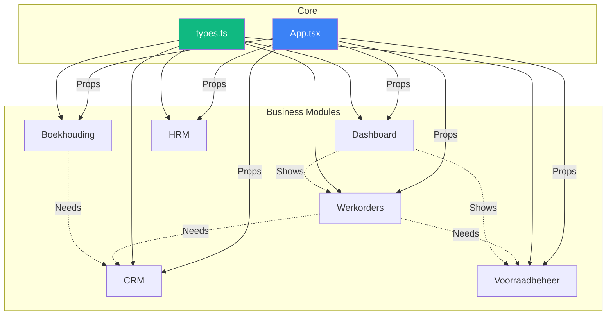

#### 7. Database Schema (Future)

```markdown
📊 **[DIAGRAM: database-schema.mermaid]**
**Locatie:** docs/05-api/overview.md
**Type:** Entity Relationship Diagram
**Toon:** User, Customer, WorkOrder, Quote, Invoice relationships
```

**Template:**
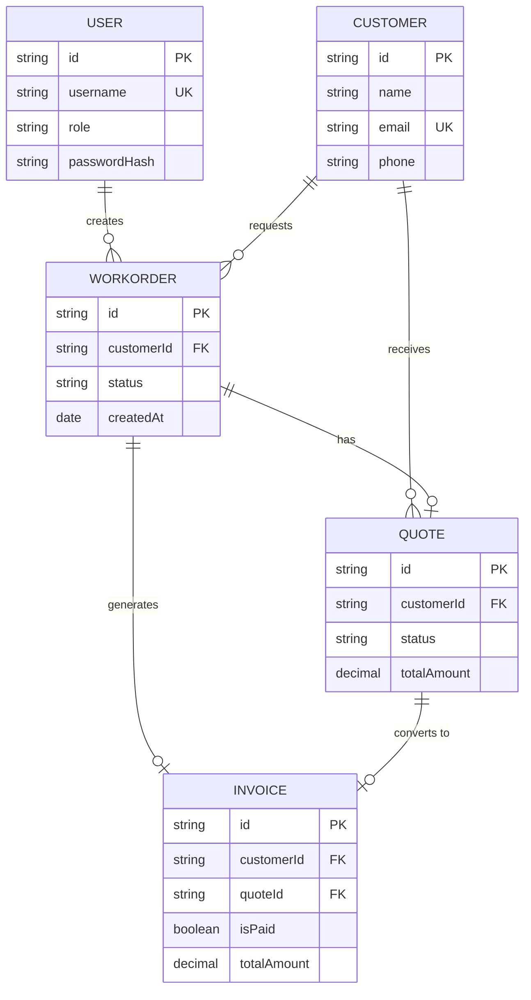

#### 8. Component Tree (Example: Werkorders)

```markdown
📊 **[DIAGRAM: component-tree-workorders.mermaid]**
**Locatie:** docs/03-modules/workorders.md
**Type:** Tree diagram
**Toon:** WorkOrders → WorkOrderKanban → WorkOrderCard
```

**Template:**
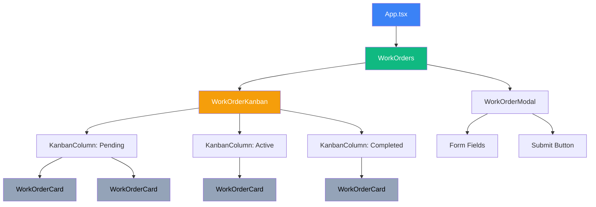

---

### UI/UX Diagrams (5 diagrams)

#### 9. Mobile Breakpoints

```markdown
📊 **[DIAGRAM: mobile-breakpoints.mermaid]**
**Locatie:** docs/04-features/mobile-optimization.md
**Type:** Diagram
**Toon:** Responsive breakpoints (sm, md, lg, xl)
```

#### 10. User Journey Map

```markdown
📊 **[DIAGRAM: user-journey-quote-to-invoice.mermaid]**
**Locatie:** docs/04-features/workorder-workflow.md
**Type:** Flowchart
**Toon:** User journey from quote creation to payment
```

#### 11. Permission Matrix

```markdown
📊 **[DIAGRAM: permissions-matrix.mermaid]**
**Locatie:** docs/04-features/user-roles.md
**Type:** Table diagram
**Toon:** Admin vs User permissions matrix
```

#### 12. Navigation Structure

```markdown
📊 **[DIAGRAM: navigation-structure.mermaid]**
**Locatie:** docs/02-architecture/file-structure.md
**Type:** Tree
**Toon:** Sidebar navigation hierarchy
```

#### 13. Color Palette

```markdown
📊 **[DIAGRAM: color-palette.svg]**
**Locatie:** docs/documentation-style-guide.md
**Type:** SVG
**Toon:** Tailwind color palette (primary, success, warning, error)
```

---

### Process Diagrams (10 diagrams)

**Remaining diagrams 14-23:**
- Email integration flow
- Stock adjustment process
- Invoice payment flow
- Report generation flow
- User onboarding flow
- Error handling flow
- State update lifecycle
- Module loading sequence
- Notification delivery flow
- Multi-agent handoff protocol

---

## 🎨 Screenshot Specifications

### Technical Requirements

**Resolution:**
- Desktop: 1920x1080 (Full HD)
- Tablet: 1024x768 (iPad)
- Mobile: 390x844 (iPhone 13 Pro)

**Format:**
- Primary: PNG (lossless, UI screenshots)
- Alternative: WebP (smaller size, modern browsers)
- Max file size: 2MB (compress if larger)

**Browser:**
- Chrome (latest stable version)
- DevTools device emulation for mobile
- No extensions enabled (clean state)

**Styling:**
- Remove personal data (use demo data)
- Consistent demo usernames (admin@example.com, user@example.com)
- Clean URLs (localhost:5173 or production domain)
- No browser warnings/errors visible

### Naming Convention

**Format:** `[module]-[view]-[detail].png`

**Examples:**
```
dashboard-overview.png
workorders-kanban-board.png
inventory-sku-modal.png
accounting-quote-form.png
crm-customer-detail.png
hrm-employee-list.png
pos-cashier-interface.png
planning-calendar-view.png
reports-sales-chart.png
webshop-product-grid.png
admin-settings-tabs.png
notifications-panel.png
```

### Directory Structure

```
docs/
└── assets/
    ├── screenshots/
    │   ├── dashboard/
    │   │   ├── dashboard-overview.png
    │   │   ├── dashboard-email-dropzone.png
    │   │   └── ...
    │   ├── workorders/
    │   ├── inventory/
    │   ├── accounting/
    │   ├── crm/
    │   ├── hrm/
    │   ├── pos/
    │   ├── planning/
    │   ├── reports/
    │   ├── webshop/
    │   ├── admin/
    │   └── notifications/
    └── diagrams/
        ├── system-architecture.mermaid
        ├── state-flow.mermaid
        ├── workorder-workflow.mermaid
        └── ...
```

---

## 📝 Placeholder Templates

### Screenshot Placeholder

**In Markdown:**
```markdown
🖼️ **[SCREENSHOT PLACEHOLDER: Dashboard Overview]**
**Toon:** Dashboard hoofdscherm met KPI cards, werkorder overzicht, en email drop zone
**Vereisten:**
- Resolutie: 1920x1080
- Browser: Chrome (laatste versie)
- Data: Demo data geladen
- Ingelogd als: Admin
**Filename:** dashboard-overview.png
**Status:** ⏳ Pending
```

### Diagram Placeholder

**In Markdown:**
```markdown
📊 **[DIAGRAM PLACEHOLDER: Authentication Flow]**
**Type:** Sequence diagram
**Toon:** Login → Credentials Check → JWT Token → Access Grant
**Tool:** Mermaid
**Bestand:** docs/diagrams/auth-flow.mermaid
**Status:** ⏳ Pending
```

---

## ✅ Checklist: Creating Screenshots

### Pre-Screenshot

- [ ] **Demo data loaded** (run seed script if available)
- [ ] **Browser clean** (no extensions, no warnings)
- [ ] **Correct user logged in** (Admin for full access screenshots)
- [ ] **Resolution correct** (1920x1080 desktop, 390x844 mobile)
- [ ] **Zoom level 100%** (no browser zoom)

### During Screenshot

- [ ] **Capture full viewport** (no cropping in browser)
- [ ] **Include relevant UI** (don't cut off important elements)
- [ ] **Cursor hidden** (unless showing interaction)
- [ ] **Animations complete** (wait for loading states)
- [ ] **Focus states correct** (no accidental focus rings)

### Post-Screenshot

- [ ] **File size < 2MB** (compress if needed)
- [ ] **Filename correct** (kebab-case, descriptive)
- [ ] **Saved in correct folder** (docs/assets/screenshots/[module]/)
- [ ] **Alt text written** (descriptive, accessible)
- [ ] **Markdown updated** (replace placeholder)

---

## 🎯 Priority List

### High Priority Screenshots (Must-Have) - 25 screenshots

1. Dashboard overview
2. Werkorders kanban board
3. Inventory overview
4. Accounting quote form
5. CRM customer list
6. HRM employee list
7. POS cashier interface
8. Login page
9. Sidebar navigation
10. User roles comparison
11-25. (One key screenshot per module)

### Medium Priority Screenshots - 40 screenshots

- Modal dialogs (create, edit, delete)
- Filter/search interfaces
- Mobile views
- Error states
- Empty states

### Low Priority Screenshots - 22 screenshots

- Detail views
- Settings panels
- Advanced features
- Edge cases

---

## 📊 Diagram Creation Guide

### Tools

**Recommended:**
- **Mermaid** (preferred) - Text-based, version control friendly
  - Install: npm install -D mermaid
  - Live editor: https://mermaid.live/
- **Draw.io** - Visual editor for complex diagrams
  - Export to SVG
  - Store source in .drawio format
- **Excalidraw** - Hand-drawn style diagrams
  - Good for wireframes

### Mermaid Quick Reference

**Flowchart:**
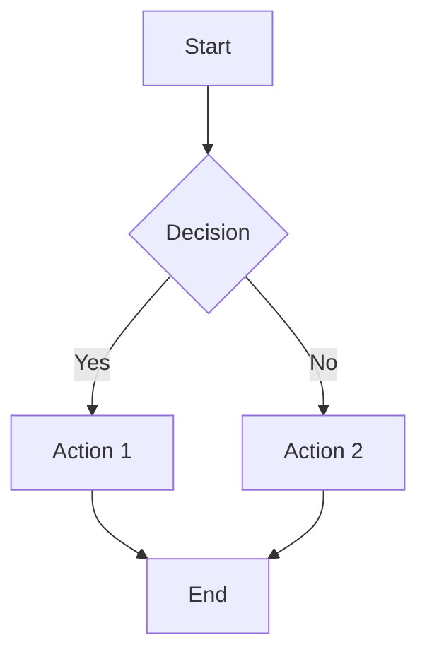

**Sequence Diagram:**
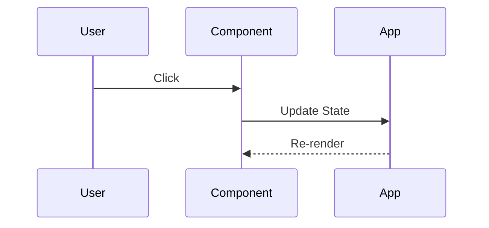

**Entity Relationship:**
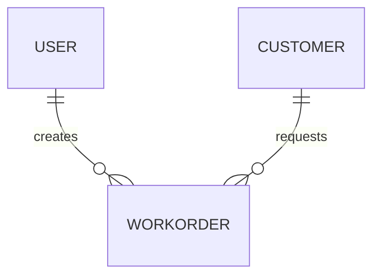

---

## 🆘 Troubleshooting Visual Content

### Screenshot Issues

**Problem:** File size too large (> 2MB)
**Solution:**
1. Use online compressor: https://tinypng.com/
2. Or ImageOptim (Mac) / FileOptimizer (Windows)
3. Target: < 500KB for web

**Problem:** Screenshot blurry on retina displays
**Solution:**
1. Take screenshot at 2x resolution (3840x2160)
2. Scale down to 1920x1080 in image editor
3. Export at high quality

**Problem:** Inconsistent styling across screenshots
**Solution:**
1. Use same demo data for all screenshots
2. Take all screenshots in one session
3. Document exact steps for reproducibility

### Diagram Issues

**Problem:** Mermaid diagram not rendering
**Solution:**
1. Check syntax at https://mermaid.live/
2. Ensure GitHub/viewer supports Mermaid
3. Export to PNG as fallback

**Problem:** Diagram too complex
**Solution:**
1. Split into multiple diagrams
2. Focus on one aspect per diagram
3. Use progressive disclosure

---

## 📚 Gerelateerde Documentatie

- [Documentation Style Guide](./documentation-style-guide.md) - Screenshot formatting
- [CONVENTIONS.md](../CONVENTIONS.md) - Code examples in screenshots
- [AI_GUIDE.md](./AI_GUIDE.md) - Generating diagrams with AI

---

**Laatste update:** Januari 2025
**Versie:** 1.0.0
**Status:** Living Document (update as screenshots are added)

**Visual content is half the story! 📸✨**
